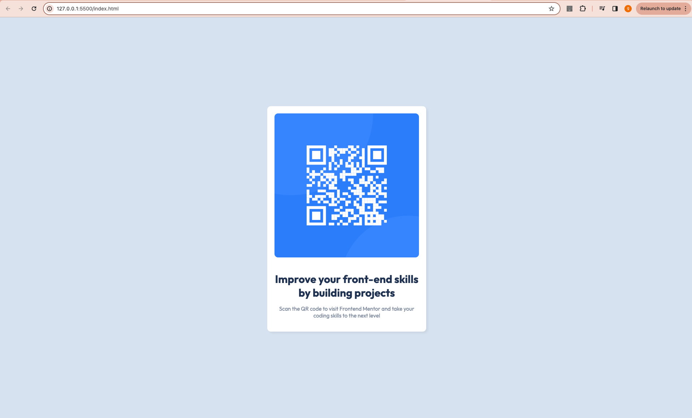

# Frontend Mentor - QR code component solution

This is a solution to the [QR code component challenge on Frontend Mentor](https://www.frontendmentor.io/challenges/qr-code-component-iux_sIO_H). Frontend Mentor challenges help you improve your coding skills by building realistic projects. 

## Table of contents

- [Overview](#overview)
  - [Screenshot](#screenshot)
  - [Links](#links)
- [My process](#my-process)
  - [Built with](#built-with)
  

**Note: Delete this note and update the table of contents based on what sections you keep.**

## Overview

Developed a QR code component solution using basic html and css styles.
### Screenshot

### Links

- Solution URL: [Add solution URL here](https://your-solution-url.com)

## My process

First I defined all the global variables i.e all the colors, and then imported the required fonts and then used the concepts of flex-box to get the output.

### Built with

- Semantic HTML5 markup
- CSS custom properties
- Flexbox
- Mobile-first workflow
